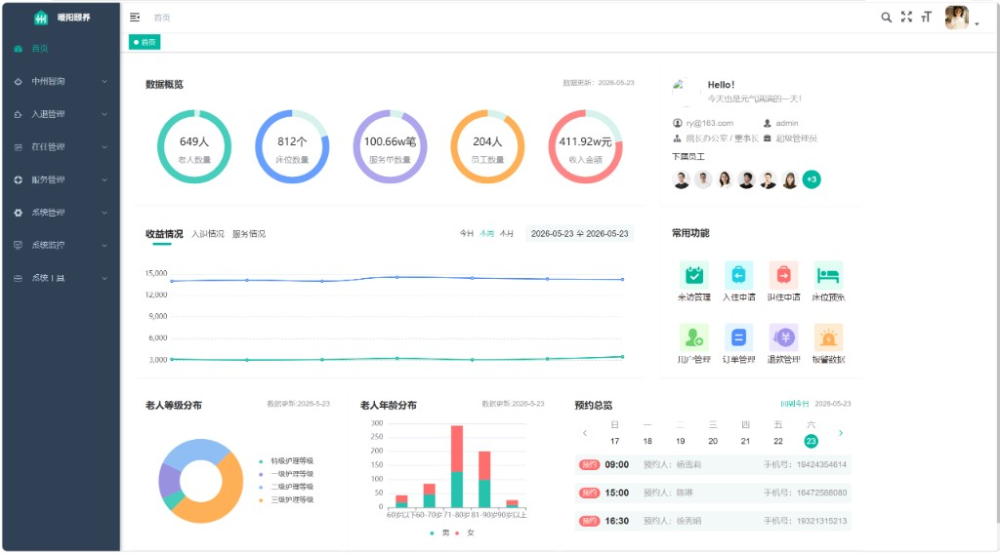
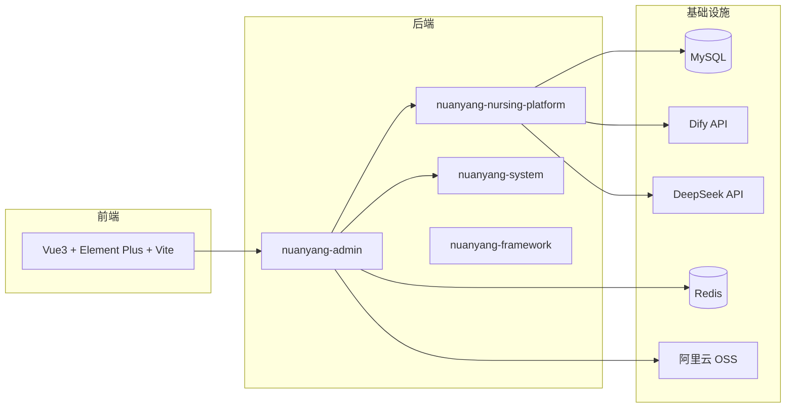

# 暖阳颐养 · 智慧养老管理平台

<p align="center">
  
</p>

<p align="center">
  <strong>Spring Boot + Vue 3 前后端分离</strong> · 机构养老业务 · AI 健康评估 · Dify 智能咨询
</p>

<p align="center">
  <a href="https://github.com/byte-love">GitHub @byte-love</a>
</p>

---

## 项目背景

随着我国老龄化程度加深，养老机构在**入住办理、护理排班、健康评估、家属沟通**等环节仍大量依赖纸质与 Excel，信息分散、查询困难。  

**暖阳颐养** 是一套面向机构养老场景的管理后台，在若依（RuoYi）快速开发框架基础上进行业务定制与智能化扩展，覆盖「入住—护理—评估—咨询」主流程，并对接 **Dify** 实现可对话的养老知识问答与业务查询能力，适合作为实习/校招作品展示全栈开发与 AI 集成能力。

---

## 功能概览

| 模块 | 说明 |
|------|------|
| 数据看板 | 老人数量、床位、服务、收入等可视化统计 |
| 入退管理 | 入住申请、合同、床位与房型配置 |
| 护理管理 | 护理计划、护理项目、护理任务与排班 |
| 健康评估 | 上传体检报告，结合 AI 生成评估结论 |
| 暖阳智询 | 基于 Dify 的流式对话、历史会话管理 |
| 智能床位 / 设备 | 楼层房间床位可视化、设备与告警（扩展模块） |
| 系统管理 | 用户、角色、菜单、字典、日志等 RBAC 能力 |

---

## 功能演示

### 1. 登录与首页数据看板

登录页采用养老主题视觉；首页聚合核心业务指标与图表。

<p align="center">
  
</p>

- 环形图展示老人数、床位、服务量、收入等
- 折线图 / 饼图展示收益与老人结构分布
- 右侧展示当前登录用户与快捷入口

> 演示账号（导入 `sql/nuanyang.sql` 后）：`admin` / `admin123`

---

### 2. 暖阳智询（Dify 智能对话）

- 支持 **SSE 流式输出**，体验接近 ChatGPT
- 会话列表、新建对话、删除历史
- 后端 `ChatController` 对接 Dify API；`DifyServeController` 为 Agent 提供老人信息、预约等 **Tool 数据源**

> 需自行部署 Dify 并在配置文件中填写 `dify.baseUrl` 与 `dify.apiKey`，见下方「快速开始」。

<!-- 将录屏 GIF 放到 docs/images/dify-chat.gif 后取消下一行注释 -->
<!-- <p align="center"></p> -->

---

### 3. 健康评估（AI + 报告解析）

- 录入老人信息与体检报告（PDF）
- 调用大模型能力生成结构化健康评估
- 评估详情页展示风险项与护理建议

<!-- 截图可放到 docs/images/health-assessment.png -->

---

### 4. 入住与护理业务

- **入住办理**：申请 → 评估 → 签约 → 配置护理等级
- **护理计划 / 任务**：按老人等级生成计划，定时任务自动生成当日护理任务
- **预约参观**：家属端预约与到院管理

---

## 技术架构



| 层次 | 技术 |
|------|------|
| 后端 | Java 17、Spring Boot 2.5、Spring Security、JWT、MyBatis-Plus、Druid、Quartz |
| 前端 | Vue 3、Pinia、Element Plus、ECharts、Vite |
| 中间件 | MySQL 8、Redis |
| AI | Dify（对话 + RAG）、DeepSeek（健康评估等） |
| 其他 | 阿里云 OSS 文件存储、微信小程序（家属端接口预留） |

---

## 项目结构

```
nuanyang-dify/
├── nuanyang-admin/              # 启动模块
├── nuanyang-nursing-platform/   # 养老业务（入住、护理、评估、Dify）
├── nuanyang-system/             # 系统管理
├── nuanyang-framework/          # 安全、配置
├── nuanyang-common/             # 工具与通用类
├── nuanyang-quartz/             # 定时任务
├── nuanyang-ui/                 # 前端工程
├── sql/nuanyang.sql             # 数据库脚本
└── docs/images/             # README 演示截图
```

---

## 快速开始

### 环境要求

- JDK 17、Maven 3.6+
- Node.js 16+、npm / pnpm
- MySQL 8、Redis

### 1. 数据库

```bash
mysql -u root -p < sql/nuanyang.sql
```

### 2. 后端配置

复制并按本地环境修改（**勿将含真实密钥的配置提交到公开仓库**）：

```bash
# 主要编辑数据库、Redis、Dify、OSS 等
nuanyang-admin/src/main/resources/application-dev.yml
```

关键配置示例：

```yaml
spring:
  datasource:
    druid:
      master:
        url: jdbc:mysql://localhost:3306/nuanyang?...
        username: root
        password: 你的密码
  redis:
    host: 127.0.0.1
    port: 6379

dify:
  baseUrl: http://你的-dify-地址
  apiKey: app-xxxxxxxx   # 或 Bearer app-xxx
```

也可使用环境变量：`DIFY_BASE_URL`、`DIFY_API_KEY`、`DEEPSEEK_API_KEY`、`OSS_ACCESS_KEY_ID` 等。

### 3. 启动后端

```bash
mvn clean install -DskipTests
# 运行 nuanyang-admin 模块主类 RuoYiApplication
```

默认端口：`9901`

### 4. 启动前端

```bash
cd nuanyang-ui
npm install
npm run dev
```

浏览器访问控制台打印的地址（一般为 `http://localhost:80` 或 `5173`，以 Vite 输出为准）。

---

## 个人分工说明（简历可参考）

- 完成养老核心业务模块梳理与前后端联调
- 集成 **Dify** 流式对话与 **DifyServe** 业务查询接口
- 健康评估链路对接大模型与 PDF 报告处理
- 项目品牌化改造、首页/登录体验优化、README 与演示文档整理

---

## 作者

**byte-love** · [https://github.com/byte-love](https://github.com/byte-love)

---

## 致谢与声明

本项目基于 [RuoYi](https://gitee.com/y_project/RuoYi-Vue) 二次开发，仅用于学习与交流。若用于商业场景请自行评估许可证与合规要求。
